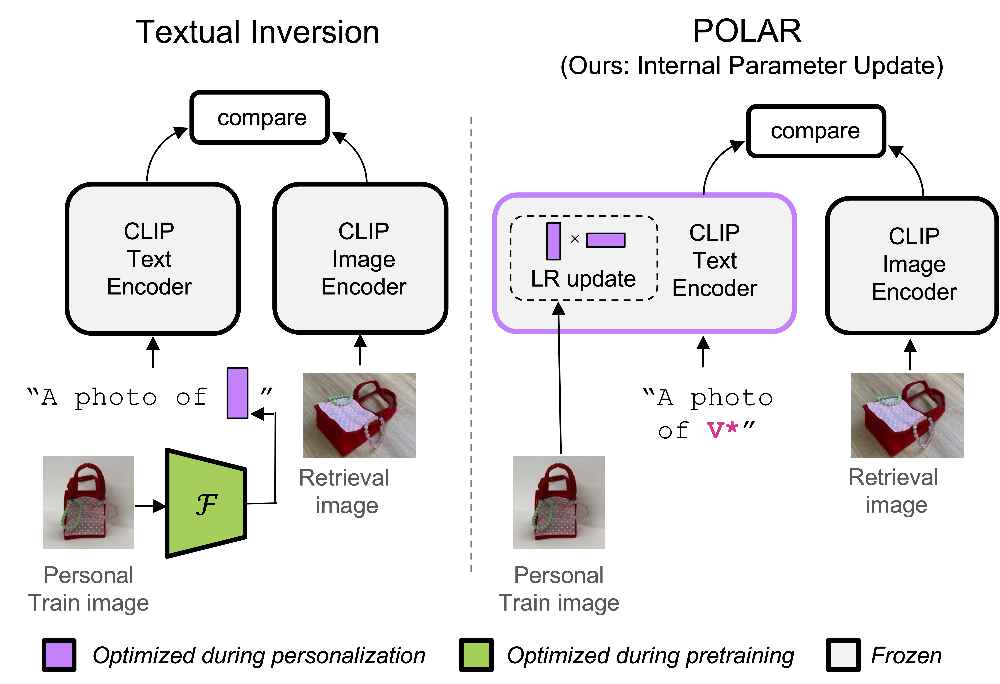

# polar-vl

This is the official code release for the CVPR 2025 paper [Improving Personalized Search with Regularized Low-Rank Parameter Updates](https://openaccess.thecvf.com/content/CVPR2025/papers/Ryan_Improving_Personalized_Search_with_Regularized_Low-Rank_Parameter_Updates_CVPR_2025_paper.pdf). 

<div style="text-align:center;">
    
</div>


We propose POLAR (PersOnalized Low-rank Adaptation for Retrieval), an efficient and effective means of adapting CLIP for vision-language retrieval with personal concepts. POLAR represents personal concepts as a rank-one parameter update to the final layer of CLIP's text encoder.


## Setup

### Conda environment

Create and activate the conda environment
```
sh setup.sh
conda activate polar-vl
```

### Prepare Datasets

Make a `data` directory in the top level of this repository.

#### Download ConConChi

Download the ConCon-Chi dataset from its source [here](https://dataverse.iit.it/dataset.xhtml?persistentId=doi:10.48557/QJ1166) and place it in the `data` folder. Unzip the file and name the directory `conconchi`.

The file structure should look like this:
```
data/
    conconchi/
        data/
        visualization/
        ...
```

#### Download DeepFashion2

Download the DeepFashion2 personalized retrieval annotation files from the [PerVL benchmark repo](https://github.com/NVlabs/PerVLBenchmark/tree/main/annotations/deep_fashion) and place them in `data/deepfashion2`. Download train.zip from the [DeepFashion2 source](https://github.com/switchablenorms/DeepFashion2), place it under `data/deepfashion2`, and unzip it.

The file structure should look like this:
```
data/
    deepfashion2/
        train/
           annos/
           image/
        shortened_deepfashion2_captions.csv
        test_captions.csv
        test_fsl_train.txt
        ...
```

#### Pre-extract CLIP Image Features

Since we only train the text encoder, we pre-extract CLIP image features for the images in the datasets. These features are stored in a `feats` subdirectory within each dataset's directory.

Extract ConCon-Chi features:

```
python extract_conconchi_feats.py \
    --data_path data/conconchi \
    --batch_size 64 \
    --clip_model ViT-L/14
```

Extract DeepFashion2 features:
```
python extract_deepfashion2_feats.py \
    --data_path data/deepfashion2 \
    --batch_size 64 \
    --clip_model ViT-L/14
```


## Personalization Demo Notebook

See ```personalize_demo.ipynb``` for an example of how to use POLAR to train a low-rank parameter update for a personal concept and visualize vision-language retrievals.

## Training

We provide train scripts for ConCon-Chi and DeepFashion2 in `train_conconchi.py` and `train_deepfashion2.py` respectively. 

By default, these save checkpoints to `./checkpoints/conconchi_train` and `./checkpoints/deepfashion2_train` but this can be customized with the `--checkpoint_save_dir` argument. Please see the arguments `train_conconchi.py` and `train_deepfashion2.py` for further training options.


## Evaluation

We provide scripts to evaluate a directory of checkpoints for each concept in `eval_conconchi.py` and `eval_deepfashion2.py`.

Evaluate on ConConChi:

```
python eval_conconchi.py \
    --checkpoint_dir checkpoints/conconchi_train \
    --clip_model ViT-L/14
```

Evaluate on DeepFashion2
```
python eval_deepfashion2.py \
    --checkpoint_dir checkpoints/deepfashion2_train \
    --clip_model ViT-L/14
```

To assess retention of general knowledge we also calculate *VLM caption recall@10*, which captions the retrieval images with LLaVA and measure general retrieval performance on these captions with the personal update for a concept applied. The LLaVA-generated captions for ConCon-Chi are available in `conconchi_llava_captions.json`.

Calculate VLM caption recall@10 on ConCon-Chi:

```
python eval_vlm_captions.py \
    --checkpoint_dir checkpoints/conconchi_train \
    --clip_model ViT-L/14
```

## Citation
```
@inproceedings{ryan2025improving,
  title={Improving Personalized Search with Regularized Low-Rank Parameter Updates},
  author={Ryan, Fiona and Sivic, Josef and Heilbron, Fabian Caba and Hoffman, Judy and Rehg, James M and Russell, Bryan},
  booktitle={Proceedings of the IEEE/CVF Conference on Computer Vision and Pattern Recognition},
  year={2025}
}
```